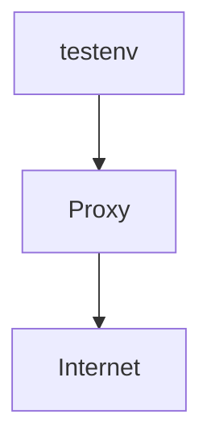

# proxy-whitelist-tester

## System



Directory structure
```
.
├── docker-compose.yml
├── squid.conf          : configurateion file for squid.
└── whitelist           : whitelist URL. See also : https://wiki.squid-cache.org/SquidFaq/SquidAcl#im-trying-to-deny-foocom-but-its-not-working
```

## How to
### Launch up servers.
```sh
$ docker compose up -d
```

### Login to testenv.
```sh
$ docker compose run -it --rm red-lan /bin/bash
```

### See access logs.
```
$ docker compose logs proxy -f
```

